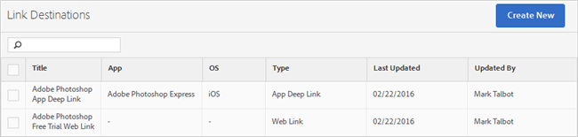

# Create and manage link destinations{#create-and-manage-link-destinations}

In the Manage Link Destinations page, you can create, edit, archive/unarchive, and delete link destinations. These destinations can be called inline when building marketing links, push notifications, or in-app messages.

To display the Manage Link Destinations page:

1. From the left navigation menu, click **[!UICONTROL Manage Apps]**. 
1. Click the name of the app to display its App Information page. 
1. In the top right side, click **[!UICONTROL Manage Link Destinations]**.

The Link Destinations page displays your link destinations and provides options to create, archive, unarchive, edit, and delete link destinations.

For example:

