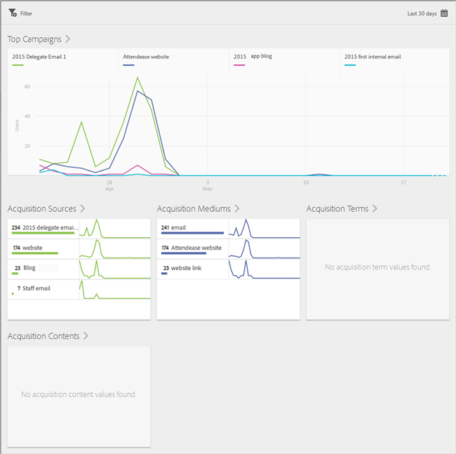
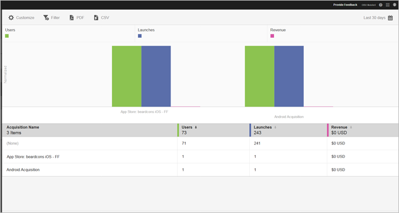

# Acquisition

You can create, edit, manage, and view reports on trackable mobile app marketing links. 

>[!TIP]
>
>This functionality requires the Adobe Analytics - Mobile Apps or the Adobe Analytics Premium SKU.

The following Acquisition reports provide insight into how your marketing links are performing: 

* [ Overview](../acquisition_main/acquisition_main.md#section_5B2BA47F22694919A472AB591101237E)
* [ Acquisition Names](../acquisition_main/acquisition_main.md#section_A23A640C363B43569D9D484CF49EA277)

## Overview {#section_5B2BA47F22694919A472AB591101237E}

This report displays the top campaigns that drove users to your app with information about how the campaigns performed across other tracking metadata such as acquisition source, medium, term, and content. 

 

## Link Report {#section_A23A640C363B43569D9D484CF49EA277}

This report provides a ranked view into your marketing links performance. In addition to seeing your link names with key performance metrics, this report is also customizable. For more information, see [ Customize Reports](../usage/reports_customize/reports_customize.md#concept_ED099E16594044E69FFD91829F436907). 

Remember the following information: 

* You can click the arrow icons in the column headers to sort the data in ascending or descending order.
* To export the data to a PDF document, you can click **[!UICONTROL  Download]**.

 
