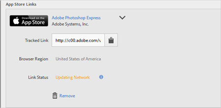

# Create an Acquisition Link

You can create app store links that let you download applications directly from the Apple App Store and Google Play. The links you create let you attribute your success events to the downloads.

<!-- I'm confused by this procedure. In the UI, there is no "Manage Acquisition Link" option under "Acquisition". Also the 4 final options listed in the table below appear only when you click "+" next to "Add Tracking Context Data". Should this procedure be removed? -->

1. Click **[!UICONTROL Acquisition]** > **[!UICONTROL Manage Acquisition Links]** > **[!UICONTROL Create New]**.
1. Type the following information in the **[!UICONTROL Link Information]** section:

<table id="table_CFCEED0575D94FD4A1433B870FA8FDB7"> 
 <thead> 
  <tr> 
   <th colname="col1" class="entry"> Field </th> 
   <th colname="col2" class="entry"> Description </th> 
  </tr>
 </thead>
 <tbody> 
  <tr> 
   <td colname="col1"> 
Name 
 </td> 
   <td colname="col2"> 
(Required) Specify a descriptive name for the app link. 
 </td> 
  </tr> 
  <tr> 
   <td colname="col1"> 
Tracking Code 
 </td> 
   <td colname="col2"> 
Specify the desired tracking code or click  Generate to create a new tracking code. 
 </td> 
  </tr> 
  <tr> 
   <td colname="col1"> 
Source 
 </td> 
   <td colname="col2"> 
(Required) Specify the original referrer, such as "newsletter" or "homepage." 
 </td> 
  </tr> 
  <tr> 
   <td colname="col1"> 
Medium 
 </td> 
   <td colname="col2"> 
Specify the marketing medium, such as "banner" or "email." 
 </td> 
  </tr> 
  <tr> 
   <td colname="col1"> 
Content 
 </td> 
   <td colname="col2"> 
Specify the name or ID of the ad with the link. 
 </td> 
  </tr> 
  <tr> 
   <td colname="col1"> 
Term 
 </td> 
   <td colname="col2"> 
Specify paid terms or other search terms for the ad. 
 </td> 
  </tr> 
 </tbody> 
</table>

   >[!IMPORTANT]
   >
   >The values in the above fields cannot be changed after the acquisition link is created.

1. Type information in the fields in the **[!UICONTROL Add App Store Link]** section.

<table id="table_1523AF0D655944F7B6DF18808D6309D1"> 
 <thead> 
  <tr> 
   <th colname="col1" class="entry"> Field </th> 
   <th colname="col2" class="entry"> Description </th> 
  </tr>
 </thead>
 <tbody> 
  <tr> 
   <td colname="col1"> 
App Store 
 </td> 
   <td colname="col2"> 
Select the desired app store: 
 
 
     <ul id="ul_9AC5044BBFCF4ECE96FE5E676FA0BB69"> 
      <li id="li_7866F0CAB9FD44E0AFAF77645C2FDD45">Apple App Store </li> 
      <li id="li_0E56414254A14AC2991552A0711732C1">Google Play </li> 
     </ul> 
 
The options for each app store vary, as described below. 
 </td> 
  </tr> 
  <tr> 
   <td colname="col1"> 
Browser Region (Apple App Store only) 
 </td> 
   <td colname="col2"> 
Specify a specific regional app store for desktop browsers. This setting lets you define the region-specific app store that you want an acquisition link to direct to when a user clicks the link from a desktop browser. 
 
Mobile devices auto-redirect based on device settings. 
 </td> 
  </tr> 
  <tr> 
   <td colname="col1"> 
Browser Language (Google Play only) 
 </td> 
   <td colname="col2"> 
Select a language from the drop-down list. This setting lets you define a specific language to display in the Google Play Store for desktop browsers. 
 
Mobile devices show language based on device settings. 
 </td> 
  </tr> 
  <tr> 
   <td colname="col1" morerows="1"> 
Search by Name 
 </td> 
   <td colname="col2"> 
For the Apple App Store, if you do not already know the  App ID, you can search for the app by its name. You can limit your search by selecting an optional region from the  In Region drop-down list. 
 </td> 
  </tr> 
  <tr> 
   <td colname="col2"> 
For Google Play, if you do not already know the  Package Name, you can search for the app name by its name. 
 </td> 
  </tr> 
  <tr> 
   <td colname="col1"> 
App ID (Apple App Store only) 
 </td> 
   <td colname="col2"> 
If you searched for the app, this field is completed automatically. You can type the  App ID value directly, rather than searching for the app. 
 </td> 
  </tr> 
  <tr> 
   <td colname="col1"> Package Name (Google Play only) </td> 
   <td colname="col2"> 
If you searched for the app, this field is completed automatically. You can type the  Package Name Name value directly, rather than searching for the app. 
 </td> 
  </tr> 
 </tbody> 
</table>

1. To save your configuration and to generate the link, click **[!UICONTROL Add]** > **[!UICONTROL Save]**.

   The newly created link displays in the **[!UICONTROL App Store Links]** section.

    
1. Click   to copy the tracked link to you clipboard.

   You can now paste the link into your social media posts, ads, email messages, and so forth. 
