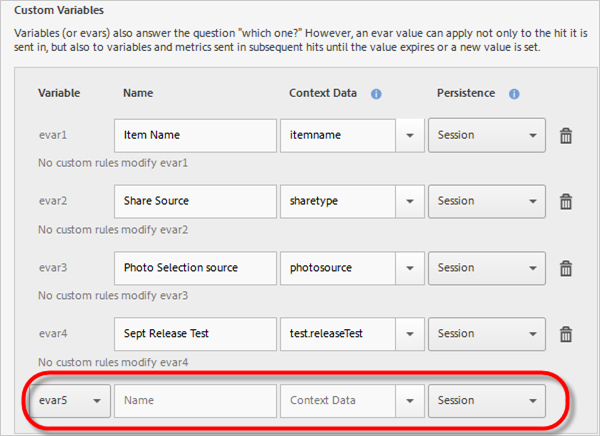

# Managing your App {#managing-your-app}

You can track and manage the data that you receive from the app by configuring a variety of variables and metrics.

## Manage Variables and Metrics {#section_EC2D58AC334F4ED49E764B81C2423A62}

* **Standard Variables & Metrics**

  Each app includes variables and metrics for tracking shopping cart and purchase activities. Some purchase information cannot be handled with processing rules, so the SDK exposes the special "&&products" context data. For example, you can have variables such as cart additions, cart removals, check outs, orders, and so on. The context data has to be mapped to data in Adobe Analytics. If this variable is populated with a simple mapping from context data, this is the key that maps to it. Leave blank if the variable is populated by more complex rules in Analytics Admin Tools.

  For more information about these variables and metrics, see the following:

  * Android: [Product Variables](/help/android/analytics-main/products/products.md)
  * iOS: [Product Variables](/help/ios/analytics-main/products/products.md)

* **Custom Variables**

  The [!DNL Custom Variables] page displays all of the custom [!DNL Analytics] variables that are configured for the report suite that contains your app data. On this page you can enable additional variables and map context data to [!DNL Analytics] variables.

### Mapping Context Data to Analytics Variables

Click  **[!UICONTROL Manage App Settings]** > **[!UICONTROL Manage Variables & Metrics]** > **[!UICONTROL Custom Variables]**.

These mappings will call the same API that is used in <!--REKHA <a href="https://docs.adobe.com/content/help/en/analytics/admin/admin-tools/processing-rules/processing-rules.html" format="https" scope="external"> processing rules.</a>-->

  

Here is a list of the custom variables that you can configure:

* The **[!UICONTROL Custom Properties]** (or props) answer the question "which one?" Props can be set to a text value that will be associated with other variables and metrics sent in the same hit. The values can be used to filter reports or can be listed in rank order by an associated metric.

    When a value is set for a property in a tracking call (or hit), it applies only to that call.
* The **[!UICONTROL Custom Variables]** (or evars) also answer the question "which one?" However, an evar value can apply not only to the hit it is sent in, but also to variables and metrics sent in subsequent hits until the value expires or a new value is set.
* The **[!UICONTROL Custom List Variables (or Multi-Value Variables)]** behave the same as variables except they allow you to capture multiple values on one hit. For more information, see
    <!--REKHA <a href="https://docs.adobe.com/content/help/en/analytics/implementation/javascript-implementation/variables-analytics-reporting/page-variables.html#concept_AC42F2D69B674C02A484137CE5B4E687" format="dita" scope="local"> List Variable.</a>-->

The following mappings display in [!DNL Analytics] as being created in Mobile Services.

* **[!UICONTROL Name]**

    The friendly name of the data collection variable.

* **[!UICONTROL Context Data]**

    If this variable is populated with a simple mapping from context data, this is the key that maps to it. Leave this field blank if the variable is populated by more complex rules in Analytics Admin Tools.

    Click in the context data column and select the context data variable that you would like mapped. The drop-down list contains variables received in the past 30 days, so if the context data you want to map is not in the list you can type it.

* **[!UICONTROL Persistence (Custom Variables and Custom List Variables)]**

    Persistence determines the point at which a Custom Variable (eVar) value will expire or will no longer be associated with additional hits. If an eVar has expired when a hit fires, the None value will be associated with that hit for that eVar. This means that no eVar value was active when the hit fired.

    You can select one of the following options:

  * **[!UICONTROL Session]**
    The eVar value will persist for the length of the Analytics visit.
  * **[!UICONTROL Tracking Call]**
    The eVar value will persist only for the tracking call or hit it in which it was included.
  * **[!UICONTROL Never Expire]**
    The eVar value will persist for all subsequent tracking calls.
  * **[!UICONTROL Advanced]**
    Adobe Analytics has a more advanced UI for setting persistence for eVars. If a persistence value is set for the eVar that is not supported in Mobile Services, this value is shown in the Mobile Services UI.

    To manage eVars, click **[!UICONTROL Adobe Analytics Report Suite Manager]** >** **[!UICONTROL Conversion Variables UI]**.  

  * **[!UICONTROL List Support]**
  Enables passing multiple values to be associated with the property in a single tracking call. The delimiter must be a single character and cannot be a zero or a space.

  * **[!UICONTROL Delimiter]**
  The delimiter must be a single character and cannot be a zero or a space.  

### Additional Analytics Variables

  You can enable additional variables using the drop-down list at the bottom of each variable section.

  

  Select an unused variable number and type a name. You can optionally provide the context data variable that you would like stored and any additional information. 

* **Custom Metrics**

  Metrics (or events) answer the questions "how much?" or "how many?" Events can increment each time the user takes an action or hold numeric values such as a price. Custom metrics include events such as an app was created, the PDF or CSV file was downloaded or exported, a campaign was saved, the SDK was downloaded, a report was run, a link to the App Store was added, an in-app message was activated, and so on.

  You can select one of the following types of custom metric types:

  * **[!UICONTROL Whole number]**
  * **[!UICONTROL Decimal number]**
  * **[!UICONTROL Currency]**

## Manage Points of Interest {#section_990EF15E4E3B42CC807FCD9BEC8DB4C6}

Points of Interest allow you to define geographical locations that you can use for correlation purposes, target with in-app messages, and so on. When a hit is sent in a point of interest, the point of interest is attached to the hit. For more information about points of interest, see [Manage Points of Interest](../location/t-manage-points.md#task_2F8223787D4E46CD827AFE156346ACBE).  

## Manage Link Destinations {#section_F722A387E22A430187B063D358A87711}

You can create, edit, archive/unarchive, and delete link destinations. These destinations can then be called inline when building marketing links, push notifications, or in-app messages. For more information about link destinations, see [Manage Link Destinations](../acquisition-main/c-manage-link-destinations/t-archive-unarchive-link-destinations.md#task_3D807CDD30964F9DB7D43AE6E720C2A8).

## Manage Postbacks {#section_78B0A8D7AE6940E78D85AE3AB829E860}

Postbacks let you send data collected by Adobe Mobile to a separate third-party server. Leveraging the same triggers and traits you use to display an in-app message, you can configure Mobile to send customized data to a third-party destination. For more information about postbacks, see [Configure Postbacks](../c-manage-app-settings/c-mob-confg-app/signals.md#concept_3471F8B9625446DBAB4C6C45AE25E91D).
