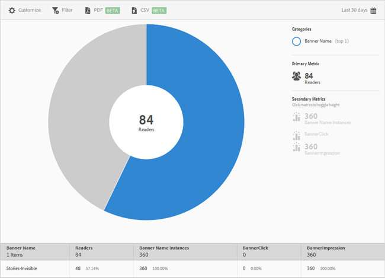

# Banner Metrics {#banner-metrics}

The Banner Metrics report displays a sunburst visualization for your existing data. This report is only available to Digital Publishing Solutions (DPS) customers.

 

By default, this report displays the following metrics:

* **[!UICONTROL Banner Name]**, which is the name of the banner. 
* **[!UICONTROL Readers]**, which is the number of app users. 
* **[!UICONTROL Banner Name Instances]**, which is the number of times the banner was referenced (clicks and impressions). 
* **[!UICONTROL Banner Click]**, which is the number of times users clicked the banner. 
* **[!UICONTROL Banner Impressions]**, which is the number of times a banner was viewed (or was visible) on a browser page.

This report is similar to the **[!UICONTROL Technology]** report. For information about how to navigate and use sunburst reports; add breakdowns and metrics; create target activities; create sticky filters, and share reports, see [Technology](/help/using/usage/reports-technology.md). The information in this topic can be used to customize the **[!UICONTROL Banner Metrics]** report. 
