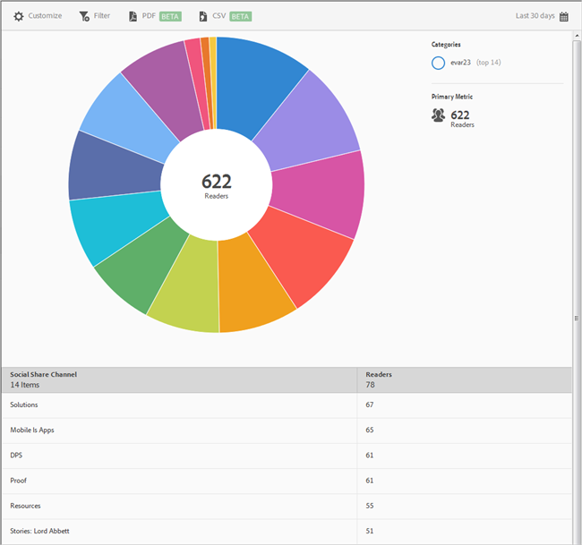

# Social Sharing{#social-sharing}

The **[!UICONTROL Social Sharing]** report displays a sunburst visualization for your existing data. This report is available to DPS customers only.

 

By default, this report shows the number of readers who shared articles in different channels, such as email, message, and so on.

This report is similar to the **[!UICONTROL Technology]** report. For information about how to navigate and use sunburst reports; add breakdowns and metrics; create target activities; create sticky filters, and share reports, see [Technology](//help/using/usage/reports-technology.md). The information in the Technology topic can be used to customize the **[!UICONTROL Social Sharing]** report. 
