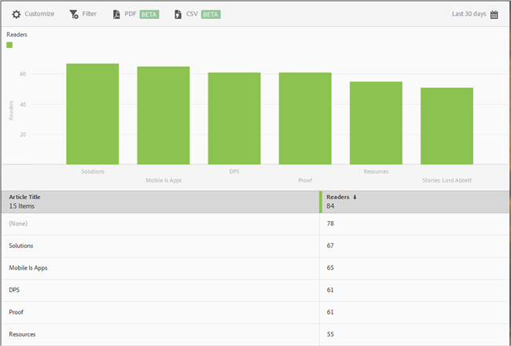

# Top 50 Articles{#top-articles}

The Top 50 Articles report displays a bar chart and ranked report showing the most-read articles displayed using the app. This report is available only to Digital Publishing Solutions (DPS) customers.

Although the default report displays data for the last 30 days by number of readers, you can customize the report as desired.

By default, this report shows article title and the number readers.

You can configure the following options for this report:

<table id="table_1F79804A6A0240A98CB73A6EBE7F1068"> 
 <thead> 
  <tr> 
   <th colname="col1" class="entry"> Option </th> 
   <th colname="col2" class="entry"> Description </th> 
  </tr>
 </thead>
 <tbody> 
  <tr> 
   <td colname="col1"> 
 Time Period 
 </td> 
   <td colname="col2"> 
Click the  Calendar icon to select a custom period or to select a preset time period from the drop-down list. 
 </td> 
  </tr> 
  <tr> 
   <td colname="col1"> 
 Customize 
 </td> 
   <td colname="col2"> 
Customize your reports by changing the  Show By options, adding metrics and filters, and adding additional series (metrics), and more 
 
For more information, see <a href="../usage/reports-customize/reports-customize.md#concept_ED099E16594044E69FFD91829F436907" format="dita" scope="local"> Customize Reports</a> 
 </td> 
  </tr> 
  <tr> 
   <td colname="col1"> 
 Filter 
 </td> 
   <td colname="col2"> 
Click  Filter to create a filter that spans different reports to see how a segment is performing across all mobile reports. A sticky filter allows you to define a filter that is applied to all non-pathing reports. 
 
For more information, see <a href="../usage/reports-customize/t-sticky-filter.md#task_75B0AD4D58014BB0A5A09FE1B074ECE1" format="dita" scope="local"> Add Sticky Filter</a>. 
 </td> 
  </tr> 
  <tr> 
   <td colname="col1"> 
 Download 
 </td> 
   <td colname="col2"> 
Click  PDF or  CSV to download or open documents and share with users who do not have access to Mobile Services or to use it in presentations. 
 </td> 
  </tr> 
 </tbody> 
</table>

