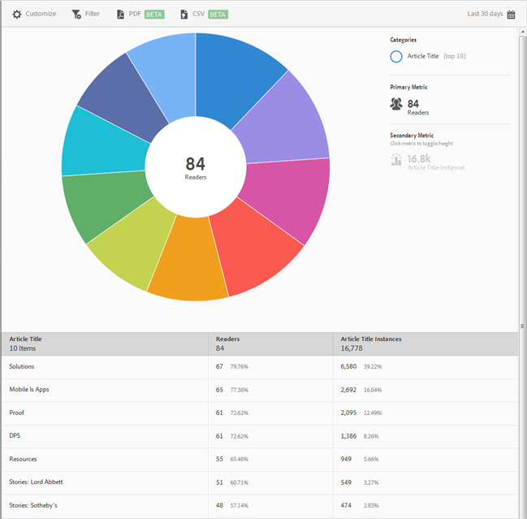

# Top 10 Articles

 

By default, this report shows the article title, the number of readers, percentage of total readers, and the article title instances and percentage. 

This report is similar to the Technology report. For information about how to navigate and use sunburst reports; add breakdowns and metrics; create target activities; create sticky filters, and share reports, see [ Technology ](../usage/reports_technology.md#concept_FA595B66323E47AE8EC785D2184F2951). The information in the topic can be used to customize the **[!UICONTROL  Top 10 Articles]** report. 
