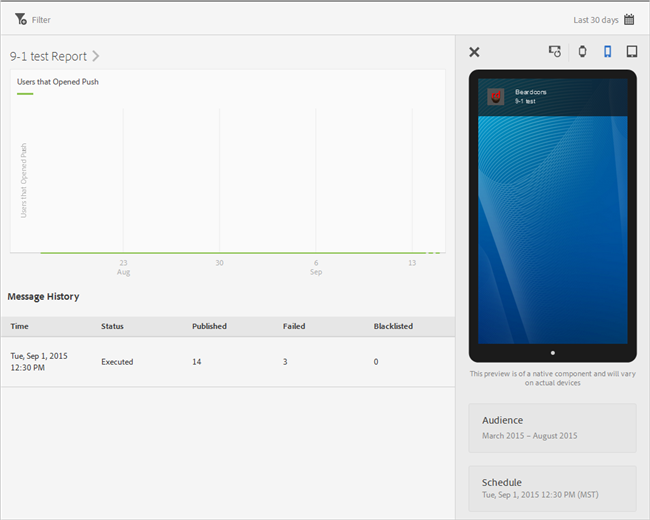

# View message reports{#view-message-reports}

You can view message reports for in-app and push messages.

1. Click  in the **[!UICONTROL Report]** column for a message.
1. (**Optional**) Create a sticky filter for the report or change the time period by clicking the **[!UICONTROL Calendar]** icon.

    For more information about creating a sticky filter, see [Add a sticky filter](/help/using/usage/reports-customize/t-sticky-filter.md).

>[!TIP]
>
>Depending on the type of message you are viewing, the report might vary.

## In-app messages {#section_90B79BA58E8141F78538C187EB1BF8C7}

If you are viewing reports for an in-app message, the report looks similar to the following illustration:

### In-app message metrics

Here is a list of the metrics that are available for in-app messages:

* **[!UICONTROL Impression]**
    When a message is triggered.

* **[!UICONTROL Click through]**
    When a user presses the **[!UICONTROL Click Through]** button on an alert or full-screen message, and when a user opens the app from a local notification.

* **[!UICONTROL Cancel]**
    When a user presses the **[!UICONTROL Cancel]** button on an alert or a full-screen message.

* **[!UICONTROL Engagement Rate]**
    This is a calculated metric from Adobe Analytics and is the result of the number of click throughs divided by the number of impressions.

## Push messages {#section_BEAFD858CA194185B6F88903446058E9}

If you are viewing reports for a push message, the report looks similar to the following illustration:

The chart at the top displays the number of users who opened the message.

### Push message metrics

Here is a list of the metrics that are available for push messages:

* **[!UICONTROL Time]**

  The time the message was pushed to devices from Mobile Services.

* **[!UICONTROL Status]**

  The status of the message, and the available statuses are:

  * **[!UICONTROL Cancelled]**
  * **[!UICONTROL Scheduled]**
  * **[!UICONTROL Executing]**
  * **[!UICONTROL Executed]**

* **[!UICONTROL Published]**

  The number of device tokens that are successfully sent to Apple Push Notification Service/Google Cloud Messaging (APNS/GCM) to send the message to the users devices.

* **[!UICONTROL Failed]**

  Here are some of the reasons that the number of device tokens that were not be sent to APNS/GCM:

  * An invalid pushID

  * The push platform (APNS, GCM, and so on) that was given to push to does not exist for the job's application. For example, the platform might collect iOS push tokens but does not have APNS service configured.

  * The message might have failed because the push service was not configured correctly or the Mobile Services system is down.  

  >[!IMPORTANT]
  >
  >If you have an unusually large number of failures, check your push services configuration. If push services appears to be configured correctly, contact Adobe Customer Care.

* **[!UICONTROL Blacklisted]**

  The number of device tokens that are no longer valid to be sent to APNS or GCM. This usually means the app has been uninstalled from the device or the user changed his or her opt-in settings to receive messages. Android and iOS differ about when tokens are counted as blacklisted. Android tokens are immediately shown in the blacklisted count. iOS tokens are initially displayed as published, but based on feedback from APNS, are shown as blacklisted on subsequent messages.
