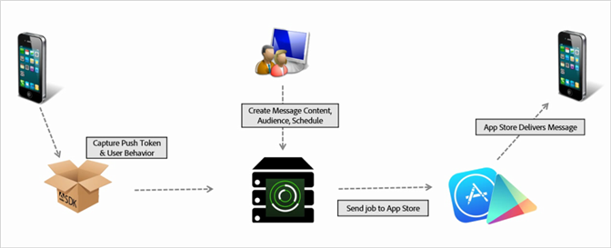

# Create a push message {#create-a-push-message}

You can send push messages to Analytics segments from the Mobile Services UI to leverage your robust Analytics data while engaging with users.

>[!IMPORTANT]
>
>Before you create a push message, see [Prerequisites to enable push messaging](/help/using/c-manage-app-settings/c-mob-confg-app/configure-push-messaging/prerequisites-push-messaging.md).

Push messages appear to users who opted in to receive notifications when they are not actively using your app. These notifications alert users about new updates, offers, and reminders. With these notifications, you can create, test, manage, and report on push messages in a streamlined workflow.

Push messages are sent server-side by the app stores rather than from Adobe Mobile Services:

To create a push message: 

1. Click **[!UICONTROL *your_app_name* >]** **[!UICONTROL Messaging >]** **[!UICONTROL Manage Messages >]** **[!UICONTROL Create Message >]** **[!UICONTROL Create Push]**.
1. Configure the audience options.

    For more information, see [Audience: define and configure audience segments for push messages](/help/using/in-app-messaging/t-create-push-message/c-audience-push-message.md).
