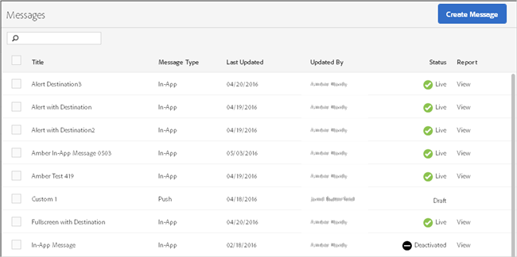

# Manage Messages

View a list of your in-app and push messages with details about when each message was last updated and whether the messages are live or deactivated.

You can duplicate, activate/deactivate, and archive/unarchive messages. You can also view a report that displays the number of users who have viewed the message and the number of users who have clicked through the message.

To manage messages, click **[!UICONTROL *`<app name>`*]** > **[!UICONTROL Messaging]** > **[!UICONTROL Manage Messages]** .

Here is additional information about the tasks you can complete on messages:

* [Search and Filter Messages](../../in_app_messaging/messages_manage/messages_manage.md#section_9D7CD24C1B8C46158530C748B7825E10) 
* [Duplicate Messages](../../in_app_messaging/messages_manage/messages_manage.md#section_429B73B648474C8FA1536A787C24F850) 
* [Deactivate Messages](../../in_app_messaging/messages_manage/messages_manage.md#section_96CB5A9D7E9E4E1DBA816785E8357E48) 
* [Archive Messages](../../in_app_messaging/messages_manage/messages_manage.md#section_8ADE6899C5E045589AACEA5B1F8B3795) 
* [View Archived Messages](../../in_app_messaging/messages_manage/messages_manage.md#section_C954EA0F96B243C19CA35BC5D7CA8F62)

## Search and Filter Messages {#section_9D7CD24C1B8C46158530C748B7825E10}

Use the Search box at the top of the list to search for and filter messages. Anything you type in the search box displays matching messages from the list. The search works across all table columns. For example, you can type `Draft` to display only messages with that status. You can also type a user's name to display only messages updated by that user.

In addition to the Search box, you can also click any column header to sort the list in ascending or descending order by the contents of that column.

For example, if you sort the **[!UICONTROL Message Type]** column in ascending order, all of your in-app messages display before your push messages. If you sort the **[!UICONTROL Last Updated]** column in descending order, the list displays your most recently updated messages at the top of the list.

## Duplicate Messages {#section_429B73B648474C8FA1536A787C24F850}

1. Select the check box next to one or more messages and click **[!UICONTROL Duplicate Selected]**. 
1. Select the app for which you want to make a duplicate message. 
1. Type a name for the message.

   To duplicate a message for the same app, type a new name for the message. If you keep the same name to overwrite the original message. If you are duplicating a message for a different app, you can keep the same name without overwriting the original message. 

1. Click **[!UICONTROL Duplicate]** or **[!UICONTROL Overwrite]**, as necessary.

## Deactivate or Activate Messages {#section_96CB5A9D7E9E4E1DBA816785E8357E48}

To deactivate a message, select the checkbox next to at least one active message and click **[!UICONTROL Deactivate Selected]**.

To activate a dectivated message, select the checkbox next to at least one deactivated message and click **[!UICONTROL Activate Selected]**.

## Archive Messages {#section_8ADE6899C5E045589AACEA5B1F8B3795}

You can archive messages and clean up your message list.

>[!NOTE] {othertype="Prerequisite"}
>
>Before you can archive a message, you must deactivate it.

1. Select the checkbox next to at least one deactivated messages and click **[!UICONTROL Archive Selected]**.

## View Archived Messages {#section_C954EA0F96B243C19CA35BC5D7CA8F62}

1. Click **[!UICONTROL View Archive]**. 
1. Select the checkbox next to at least one archived message and click **[!UICONTROL Unarchive Selected]**.

