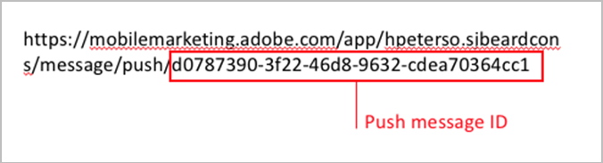
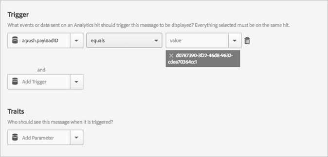

# Trigger an In-App Message when the App is Opened from a Push Message

You can set the in-app message trigger to be the push message ID that is sent when a user opens the app from the push message.

1. Get the push message ID for the push message that will be sent to the user.

   You can find the push message ID in the URL during the message creation workflow.

   Here is an example:

   

    

1. Save and activate the in-app message with the following trigger:

   `“a.push.payloadID” =`

   >[!TIP]
   >
   >The push message ID is the ID that you located in step 1.

   This trigger must be manually added because it is not available in the **[!UICONTROL Trigger]** drop-down list.

   

    

1. Save and send the push message that has the push ID that you located in step 1.
1. Click through the push message to open the app and verify that the in-app message displays when the app opens.

   While you are testing, remember the following information:

* After you save the in-app message, it takes about 45 seconds for the hosted config file to update with the new message. 
* The app looks for config file updates (the new in-app message) when there is a **new** launch, so you must ensure that the app is firing a new launch when the push message is clicked.

  This usually means that you need to ensure that the session timeout has occurred. The default timeout is 5 minutes.

