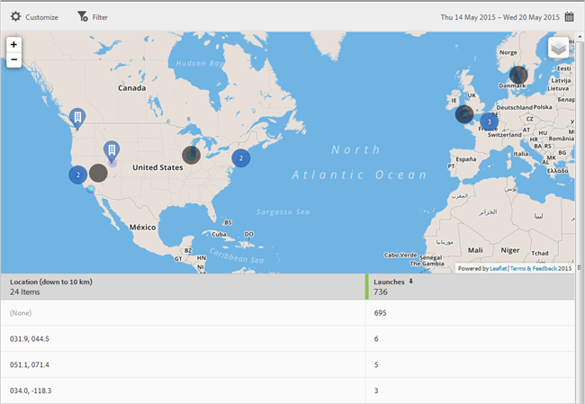

# Map{#map}

You can view an interactive map that displays your Points of Interest and other data markers.

 

Here is some important information about the map:

* You can enlarge or shrink the map.

  This feature is useful, for example, if you have two points of interest that are close together. Enlarging the map lets you view it in greater detail. 
* Your points of interest display in blue.

  Other data markers, such as Launches, display in black. Click a marker to view more information.

Click  

to select the following options:

<table id="table_74BAB1D1B77C4C78B4E26C65D4CDE4A6"> 
 <thead> 
  <tr> 
   <th colname="col1" class="entry"> Option </th> 
   <th colname="col2" class="entry"> Description </th> 
  </tr>
 </thead>
 <tbody> 
  <tr> 
   <td colname="col1"> 
 Map  
 </td> 
   <td colname="col2"> 
Display a simple map. 
 </td> 
  </tr> 
  <tr> 
   <td colname="col1"> 
 Satellite  
 </td> 
   <td colname="col2"> 
Display the map in satellite mode. 
 </td> 
  </tr> 
  <tr> 
   <td colname="col1"> 
 Data Markers 
 </td> 
   <td colname="col2"> 
Choose whether to display black data markers. 
 </td> 
  </tr> 
  <tr> 
   <td colname="col1"> 
 Heat Map 
 </td> 
   <td colname="col2"> 
Choose whether to display heat-map markers. The greater the intensity of the color, the more frequently the condition (Launches, for example) is met. 
 </td> 
  </tr> 
  <tr> 
   <td colname="col1"> 
 Points of Interest  
 </td> 
   <td colname="col2"> 
Choose whether to display your points of interest. 
 </td> 
  </tr> 
 </tbody> 
</table>

You can configure the following options for this report: 

<table id="table_1F79804A6A0240A98CB73A6EBE7F1068"> 
 <thead> 
  <tr> 
   <th colname="col1" class="entry"> Option </th> 
   <th colname="col2" class="entry"> Description </th> 
  </tr>
 </thead>
 <tbody> 
  <tr> 
   <td colname="col1"> 
 Time Period 
 </td> 
   <td colname="col2"> 
Click the  Calendar icon to select a custom period or to select a preset time period from the drop-down list. 
 </td> 
  </tr> 
  <tr> 
   <td colname="col1"> 
 Customize 
 </td> 
   <td colname="col2"> 
Customize your reports by changing the  Show By options, adding metrics and filters, and adding additional series (metrics), and more 
 
For more information, see <a href="../usage/reports-customize/reports-customize.md#concept_ED099E16594044E69FFD91829F436907" format="dita" scope="local"> Customize Reports</a> 
 </td> 
  </tr> 
  <tr> 
   <td colname="col1"> 
 Filter 
 </td> 
   <td colname="col2"> 
Click  Filter to create a filter that spans different reports to see how a segment is performing across all mobile reports. A sticky filter allows you to define a filter that is applied to all non-pathing reports. 
 
For more information, see <a href="../usage/reports-customize/t-sticky-filter.md#task_75B0AD4D58014BB0A5A09FE1B074ECE1" format="dita" scope="local"> Add Sticky Filter</a>. 
 </td> 
  </tr> 
  <tr> 
   <td colname="col1"> 
 Download 
 </td> 
   <td colname="col2"> 
Click  PDF or  CSV to download or open documents and share with users who do not have access to Mobile Services or to use it in presentations. 
 </td> 
  </tr> 
 </tbody> 
</table>

