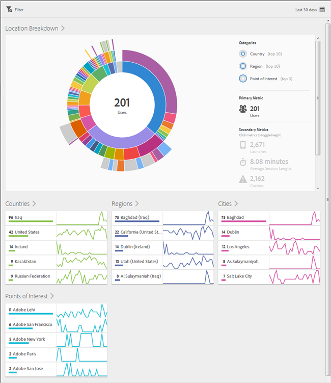
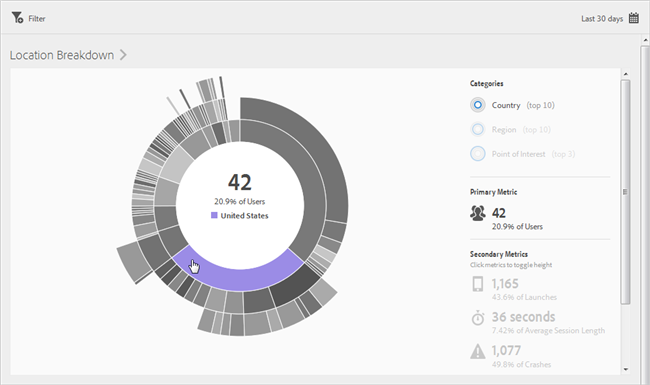
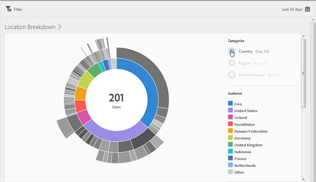
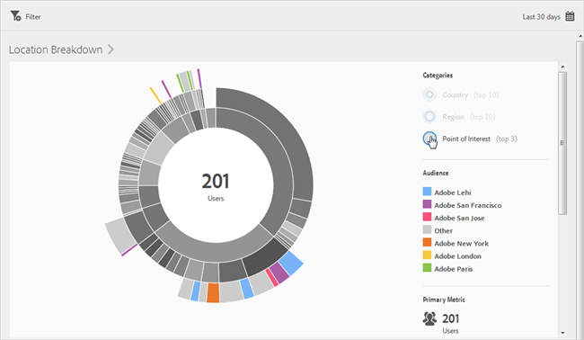
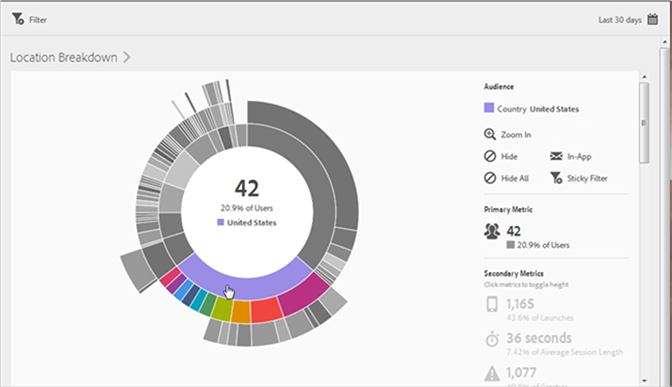
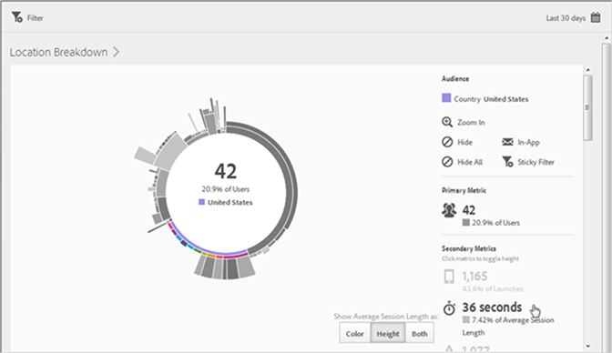
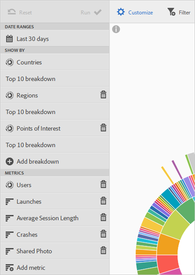

# Overview (Location)

This report provides a sunburst visualization for your existing data, and you can use the report to discover audience segments (collections of visitors) for targeting. Creating and managing audiences is similar to creating and using segments, except that you can make the audiences available in the [!DNL  Experience Cloud]. 

This section contains the following information: 

* [ Navigation and Usage](../location/c_location_overview.md#section_4A88C3849B5847BF8CF433CCFD99FDC3)
* [ Add Breakdowns and Metrics](../location/c_location_overview.md#section_15833511E82648869E7B1EFC24EF7B82)
* [ Create a Sticky Filter](../location/c_location_overview.md#section_365999D49FC744ECBF9273132497E06C)
* [ Share Reports](../location/c_location_overview.md#section_F8AF2AA73D4C4C008976D45847F82D0B)

## Navigation and Usage {#section_4A88C3849B5847BF8CF433CCFD99FDC3}

This visualization provides, for example, the base report with breakdowns. The visualization uses height to show the metric in focus, and the performance differences between the metrics. Each ring represents an audience segment in the ring's category. You can take actions on an audience, such as applying a Sticky Filter, hiding a metric, and viewing metrics. 

>[!TIP]
>
>In addition to this information, you can view an in-product tutorial that describes how to interact with the sunburst chart. To launch the tutorial, click **[!UICONTROL  Location Breakdown]** in the title bar of the report and click the **[!UICONTROL  i]** icon. 

 

This sunburst chart is interactive. You can change the time period by clicking the **[!UICONTROL  Calendar]** icon in the top right side. Mouse over any part of the chart to display more information. For example, in the following illustration, you can see the total number and the percentage of users using your app in the United States. 

 

In this illustration, the **[!UICONTROL  Categories]** buttons in the upper right corner allow you to toggle between viewing information about the top ten countries, regions, and the top three **[!UICONTROL  Points of Interest]**. 

Here is the visualization when you select **[!UICONTROL  Country]**: 

 

Here is the visualization when you select **[!UICONTROL  Points of Interest]**: 

 

You can click a slice in the ring to select the audience on which you can perform actions, such as zooming in, hiding audiences, creating an in-app message, or a Sticky Filter. 

  

You can click a secondary metric on the right side to add it to the visualization and display this metric by using color, height, or both. 

  

## Add Breakdowns and Metrics {#section_15833511E82648869E7B1EFC24EF7B82}

You can add breakdowns and secondary metrics, which change the height of each audience relative to the other audiences in the chart. 

>[!TIP]
>
>The more rings you add to the sunburst, the longer it takes to process.

To add breakdowns and secondary metrics, click **[!UICONTROL  Location Breakdown]** in the title bar of the report and click **[!UICONTROL  Customize]** to open the right rail. 

 

When you click **[!UICONTROL  Add Breakdown]** or **[!UICONTROL  Add Metric]**, a new item displays with the same name as the previous item in the respective list. Click the newly created breakdown or metric to access a drop-down list from which you can select a new item. 

## Create a Sticky Filter {#section_365999D49FC744ECBF9273132497E06C}

Click a slice in the ring to select the audience for which you want to create a sticky filter and click **[!UICONTROL  Sticky Filter]**. This sticky filter lets you apply the current filters and run a new report based on the filters. 

## Share Reports {#section_F8AF2AA73D4C4C008976D45847F82D0B}

After you create a report, your settings are used to create a custom URL, which you can copy and share. 
