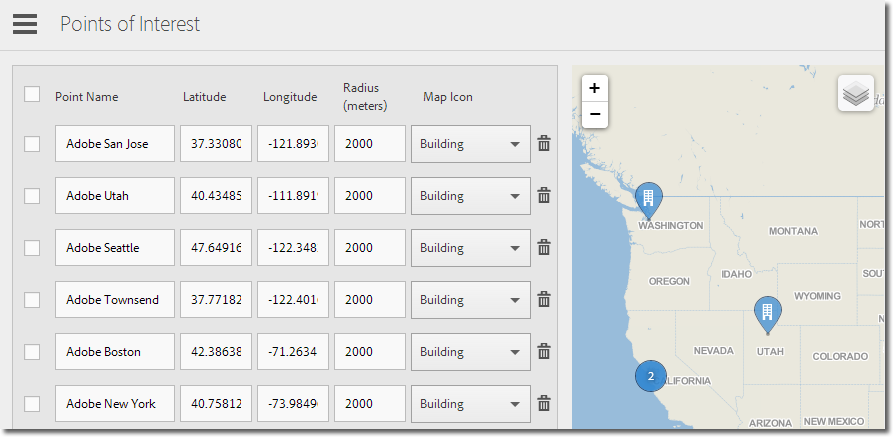

# Manage Points of Interest

To use [!UICONTROL  Location] features, you must do the following: 

* You must have [!DNL  Analytics—Mobile Apps] or [!DNL  Analytics Premium]. 

* You must enable **[!UICONTROL  Location Reports]** for the app. 

* If you are using a version of the iOS SDK or Android SDK before 4.2, after adding new **[!UICONTROL  Points of Interest]**, you must download a new configuration file and give it to your app developers. 

  If you are using the [ iOS SDK](https://marketing.adobe.com/resources/help/en_US/mobile/ios/) or [ Android SDK](https://marketing.adobe.com/resources/help/en_US/mobile/android/) versions 4.2 or later, you do not need to submit an app update to the store to update your **[!UICONTROL  Points of Interest]**. On the [!UICONTROL  Manage Points of Interest] page, clicking **[!UICONTROL  Save]** packages changes to the **[!UICONTROL  Points of Interest]** list and updates the configuration file for the live app. Saving also updates the list of points in your app on the user devices, as long as the app uses the updated SDK and configuration with a remote points-of-interest URL. 

On the user's device, for a hit to be assigned to a **[!UICONTROL  Points of Interest]**, location must be enabled for the app. 

>1. Click the name of the app to go to its [!UICONTROL  Manage App Settings] **[!UICONTROL]** page.
>1. Click **[!UICONTROL  Location]** > **[!UICONTROL  Manage Points of Interest]**.

>   <!-- In "Manage App Settings" page, I don't see "Location" as an option. I only see the "Manage Points of Interest" tab at the top of the page. -->
>    

>   Type information in to each of the fields: 

><table id="table_5BFF39183C0F44FE9478F1E6173B4888"> 
 <thead> 
  <tr> 
   <th colname="col1" class="entry"> Option </th> 
   <th colname="col2" class="entry"> Description </th> 
  </tr>
 </thead>
 <tbody> 
  <tr> 
   <td colname="col1"> 
 Point Name 
 </td> 
   <td colname="col2"> 
Type the  Point of Location name. This could be the name of a city, county, or region. You can also create a  Point of Location around specific locations, such as sports stadiums or businesses. 
 </td> 
  </tr> 
  <tr> 
   <td colname="col1"> 
 Latitude  
 </td> 
   <td colname="col2"> 
Type the latitude of the  Point of Location. You can find this information from other sources, including the Internet. 
 </td> 
  </tr> 
  <tr> 
   <td colname="col1"> 
 Longitude  
 </td> 
   <td colname="col2"> 
Type the longitude of the  Point of Location. You can find this information from other sources, including the Internet. 
 </td> 
  </tr> 
  <tr> 
   <td colname="col1"> 
 Radius (Meters) 
 </td> 
   <td colname="col2"> 
Type the radius (in meters) around the  Point of Location that you want to include. 
 
For example, if you create a point of interest, for Denver, Colorado, you could specify a radius large enough to include the city of Denver and the surrounding areas but exclude Colorado Springs. 
 </td> 
  </tr> 
  <tr> 
   <td colname="col1"> 
 Map Icon  
 </td> 
   <td colname="col2"> 
Select an icon that will display on the <a href="../location/c_location_overview.md#concept_D5FA9592A77D46898A7E6DAAC78E1712" format="dita" scope="local"> Overview</a> and <a href="../location/c_map_points.md#concept_E51E9A97ED4D4729ADC40492DA32FC2B" format="dita" scope="local"> Map</a> reports. 
 </td> 
  </tr> 
 </tbody> 
</table>

>
>1. Add additional points of interest, as needed.

>       We recommend that you add no more than 5,000 points of interest. If you add more than 5,000, you can save the points, but you will receive a warning message informing you that best practices dictate having fewer than 5,000 points. 
>1. Click **[!UICONTROL  Save]**.
