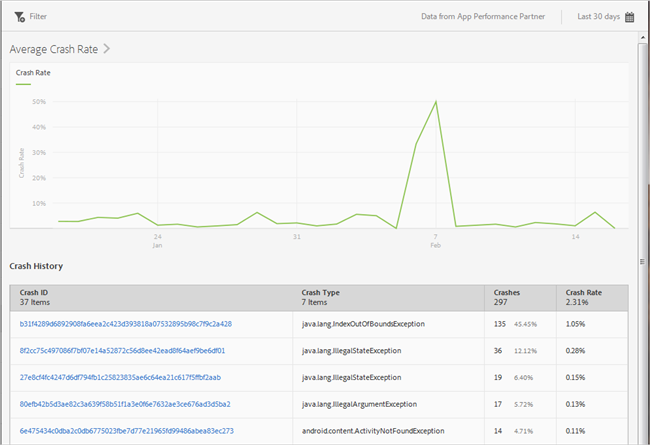

# Crashes{#crashes}

The Crashes report provides a snapshot of your app's crashes. You can see the number of crashes and the crash rate and log in to the Apteligent user interface.

>[!IMPORTANT]
>
>To display the Crash report in the left navigation, you must first integrate your app with Apteligent.

The Average Crash Rate graph displays the crash rate by date. You can hover over any date to view the crash rate for that day.

The Crash History chart displays information about each app crash, including the crash ID, crash type, number or crashes, and the crash date. To log in to Apteligent to view more details about a crash, click the link in the **[!UICONTROL Crash ID]** column.

You can configure the following options for this report:

<table id="table_6D00725707854775A05C72BDFCA8EB12"> 
 <thead> 
  <tr> 
   <th colname="col1" class="entry"> Option </th> 
   <th colname="col2" class="entry"> Description </th> 
  </tr>
 </thead>
 <tbody> 
  <tr> 
   <td colname="col1"> 
 Time Period 
 </td> 
   <td colname="col2"> 
Click the  Calendar icon to select a custom period or to select a preset time period from the drop-down list. 
 </td> 
  </tr> 
  <tr> 
   <td colname="col1"> 
 Filter 
 </td> 
   <td colname="col2"> 
Click  Filter to create a filter that spans different reports to see how a segment is performing across all mobile reports. A sticky filter allows you to define a filter that is applied to all non-pathing reports. 
 
For more information, see <a href="../usage/reports-customize/t-sticky-filter.md#task_75B0AD4D58014BB0A5A09FE1B074ECE1" format="dita" scope="local"> Add Sticky Filter</a>. 
 </td> 
  </tr> 
 </tbody> 
</table>

