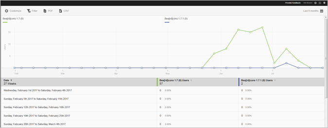

# Versions report {#versions}

The Versions report is an over-time report that displays information about the different versions of your app that are running on a users' device.

Here is an example of this report:

