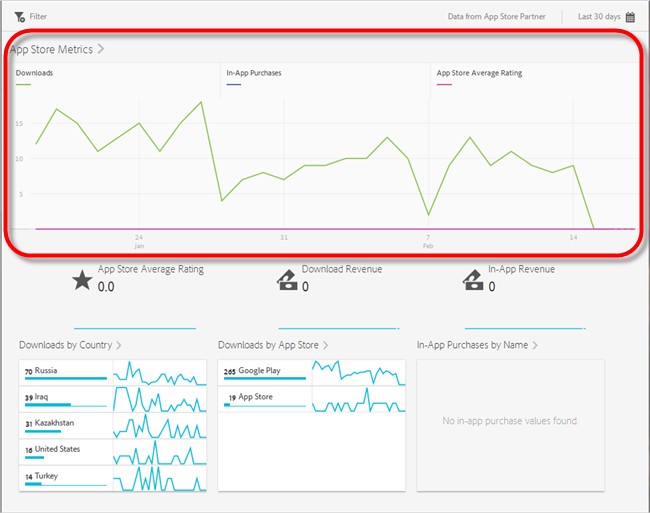
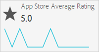
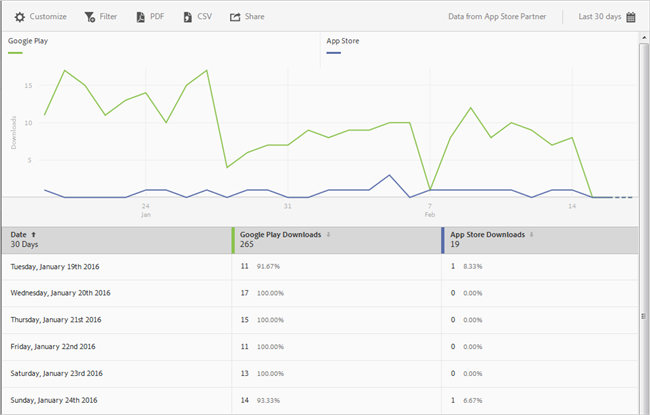
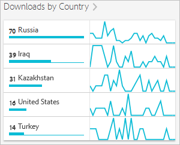
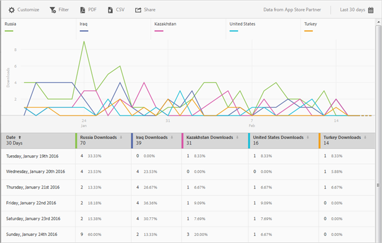
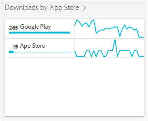

# App Store Overview Report

The App Store Overview report gives you a snapshot of your app store metrics, including the number of downloads, in-app purchases, app store average rating, download revenue, in-app revenue, downloads by country, downloads by app store, and in-app purchases by name.

>[!TIP]
>
>In the Mobile Services UI, the **[!UICONTROL App Store]** menu item and **[!UICONTROL Overview]** report appear in the left navigation menu after you configure the integration.

The **[!UICONTROL Overview]** report contains an over-time graph that displays information about the number of app store downloads, in-app purchases made by using your app, and your app's average rating.

You can click any metric to hide or display its corresponding line. To view the data for a day, hover over that day.

>[!NOTE]
>
>App store metrics, such as downloads, rank, revenue, rating, and so on in Adobe Analytics require a Data Connector integration with an appropriate vendor. `appFigures` currently provides an integration, which requires purchasing the appropriate product and/or service from `appFigures` **before** you can enable the integration. For more information about Data Connector integrations, see [Adobe Exchange](https://www.adobeexchange.com/experiencecloud.html).

The following information displays below the graph:

* [App Store Average Rating](../usage/c_app_store_store_performance.md#section_60D0D21824AE4450BC3E34D7ACA12A7A) 
* [Download Revenue](../usage/c_app_store_store_performance.md#section_34F05998E8444544A1B507C1B852C4EE) 
* [In-App Revenue](../usage/c_app_store_store_performance.md#section_58792ED9C4B54B7D836E30CF09E8E204) 
* [Downloads by Country](../usage/c_app_store_store_performance.md#section_10373CD28CA94BA5859DFDEED7D548C6) 
* [Downloads by App Store](../usage/c_app_store_store_performance.md#section_F1CD1A3F0105469D879E4F280CE32484) 
* [In-App Purchases by Name](../usage/c_app_store_store_performance.md#section_D747A64F9F6449E0A02EF31D56C92F83)

>[!TIP]
>
>In addition to changing the report's date range by clicking the calendar icon in the top right, you can customize some of the drill-down reports, add filters and series (metrics), add sticky filters, and download the report in PDF or CSV format. For more information, see [Customize Reports](../usage/reports_customize/reports_customize.md#concept_ED099E16594044E69FFD91829F436907).

## App Store Average Rating {#section_60D0D21824AE4450BC3E34D7ACA12A7A}

This report displays the average rating users gave your app using app-store functionality.

You can click anywhere on the App Store Average Rating widget to display a graph and chart that displays the average rating by date. To view the data for a day, hover over that day.

## Download Revenue {#section_34F05998E8444544A1B507C1B852C4EE}

This report displays the amount of revenue that is generated by downloading your app.

## In-App Revenue {#section_58792ED9C4B54B7D836E30CF09E8E204}

This report displays the amount of revenue from in-app purchases that were made using your app.

## Downloads by Country {#section_10373CD28CA94BA5859DFDEED7D548C6}

This report displays the number of downloads for your app grouped by country.

To display a graph and chart that displays the number of downloads per country by date, click **[!UICONTROL Downloads by Country]**. You can hover over a date to view the data for a day.

## Downloads by App Store {#section_F1CD1A3F0105469D879E4F280CE32484}

This report displays the number of downloads for your app grouped by app store.

To display a graph and chart that displays the number of downloads per app store grouped by date, click **[!UICONTROL Downloads by App Store]**. You can hover over a date to view the data for that day.

## In-App Purchases by Name {#section_D747A64F9F6449E0A02EF31D56C92F83}

This report displays all in-app purchases by name. 
