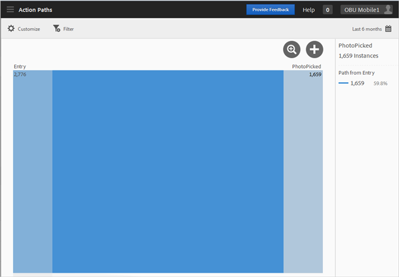
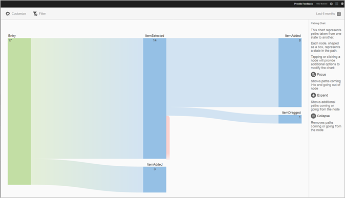
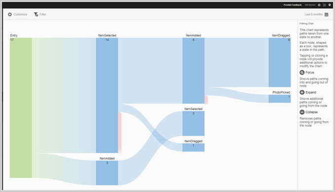
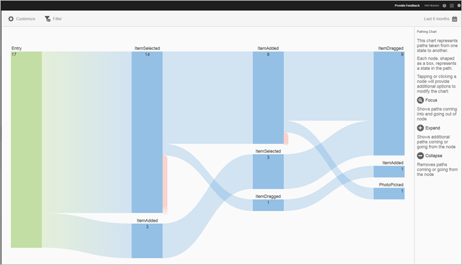

# Action Paths report{#action-paths}

The Action Paths report is based on path analysis and displays a pathing chart that represents the paths that are taken from one state to another state in the app.

 Both the **[!UICONTROL View Paths]** and **[!UICONTROL Action Paths]** reports are pathing reports. The **[!UICONTROL View Paths]** report shows you how users navigate in your app from one screen to the next. The **[!UICONTROL View Actions]** report shows you the sequence of actions and events, such as clicks, selections, resizing, and so on, that users perform in your app.

>[!TIP]
>
>You can use a funnel report to combine navigation and actions in one report. For more information, see [Funnel](/help/using/usage/reports-funnel.md).

Each node, shaped like a box, represents a state in the users' paths though an app. For example, in the graphic above, the top node represents the number of users who launched the app and then picked a photo from the gallery.

To display the options to modify the chart, click a node and click **[!UICONTROL Focus]** or **[!UICONTROL Expand]**. For example, if you click the **[!UICONTROL PhotoPicked]** state in the top node, the **[!UICONTROL Focus]** and **[!UICONTROL Expand]** icons display.

To expand, click the **[!UICONTROL +]** icon. This option displays the additional paths that come into, or go out of, the node. In the graphic below, state 1 is launching the app, state 2 is picking a photo (the item you previously expanded), and state 3 includes the different paths users took:

* Selecting an item 
* Adding an item 
* Dragging an item 
* Scaling an item

Expanding a state is similar to a funnel.

To isolate the node and show paths that come into, and go out of the selected node, click the   icon. In the graphic below, the following paths were completed **before** users selected a photo:

* Rotating an item 
* Scaling an item 
* Dragging an item 
* Removing an item

Of the users who selected a photo, the following paths were completed **after** the photo was selected:

* Selecting an item 
* Adding an item 
* Dragging an item 
* Scaling an item

You can focus or expand multiple nodes to get a detailed view of paths users take in your app. For example:

You can configure the following options for this report:

* **[!UICONTROL Time Period]**

    Click the **[!UICONTROL Calendar]** icon to select a custom period or to select a preset time period from the drop-down list. 

* **[!UICONTROL Customize]**

    Customize your reports by changing the **[!UICONTROL Show By]** options, adding metrics and filters, and adding additional series (metrics), and more. For more information, see [Customize reports](/help/using/usage/reports-customize/reports-customize.md).

* **[!UICONTROL Filter]**

    Click **[!UICONTROL Filter]** to create a filter that spans different reports to see how a segment is performing across all mobile reports. A sticky filter allows you to define a filter that is applied to all non-pathing reports. For more information, see [Add a sticky filter](/help/using/usage/reports-customize/t-sticky-filter.md).

* **[!UICONTROL Download]**

    Click **[!UICONTROL PDF]** or **[!UICONTROL CSV]** to download or open documents and share with users who do not have access to Mobile Services or to use the file in presentations.