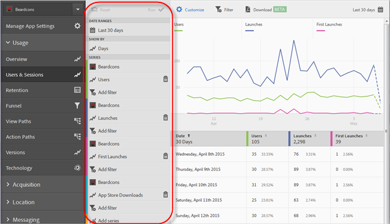
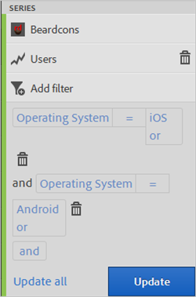
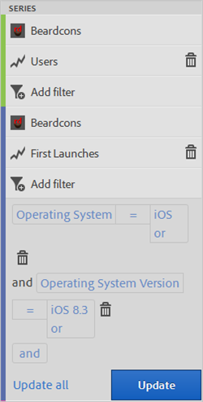
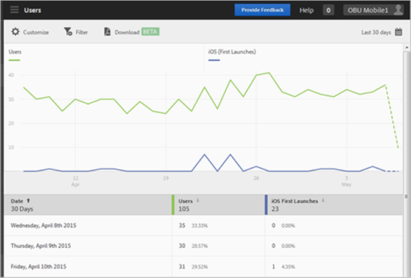

# Add filters to reports{#add-filters-to-reports}

This information helps you customize the built-in reports by adding additional filters (segments).

>[!IMPORTANT]
>
>Mobile app metrics are also available in marketing reports & analytics, ad hoc analysis, data warehouse, and other Analytics reporting interfaces. If a breakdown or report type is not available in Adobe Mobile, it can be generated by using a different reporting interface.

In this example, we will customize the **[!UICONTROL Users & Sessions]** report, but the instructions apply to any report. 

1. Open your app and click **[!UICONTROL Usage]** > **[!UICONTROL Users & Sessions]**.

   

   This report provides a complete overtime view of our app users. However, metrics for both the iOS and Android versions of this app are collected in the same report suite. We can segment users by mobile OS by adding a custom filter to the Users metric. 

1. Click **[!UICONTROL Customize]**.

   

1. Under **[!UICONTROL Users]**, click **[!UICONTROL Add Filter]** and click **[!UICONTROL Add Rule]**.

1. Select **[!UICONTROL Operating Systems]**, and from the drop-down list, and select **[!UICONTROL iOS]**.

   

   To add Android as a filter, you need to repeat this step. 

1. Click **[!UICONTROL And]**, select **[!UICONTROL Operating Systems]** from the drop-down list, and select **[!UICONTROL Android]**.

   Your filters should now look like the following example:

   

1. Click **[!UICONTROL Update]**.
1. To regenerate the report, click **[!UICONTROL Run]**.

   This report now shows users broken down by operating system. The report title was changed to match the filters that were applied to the report.

   

   You can customize this report more. From iOS 8.3, you can add the First Launches metric with an iOS 8.3 operating system version filter to see how many iOS 8.3 customers upgraded their apps and performed a first launch. 
1. Under **[!UICONTROL First Launches]**, click **[!UICONTROL Add Filter]**, click **[!UICONTROL Add Rule]**, select **[!UICONTROL Operating Systems]** from the drop-down list, and select **[!UICONTROL iOS]**.
1. Click **[!UICONTROL And]**, select **[!UICONTROL Operating System Versions]** from the drop-down list, and select **[!UICONTROL iOS 8.3]**.

   Your filters should now look like this example:

   

1. Click **[!UICONTROL Update]** and **[!UICONTROL Run]**.

   This report now shows users with iOS 8.3 who have launched the app for the first time.

   

   Take some time to test the different options on the report customization menu, and ensure that you bookmark your favorites. Report URLs in Adobe Mobile are functional and can be emailed or added to your favorites. 
