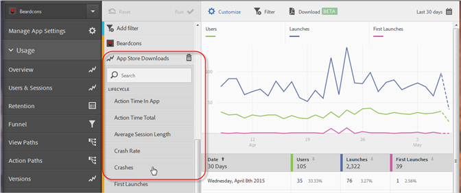
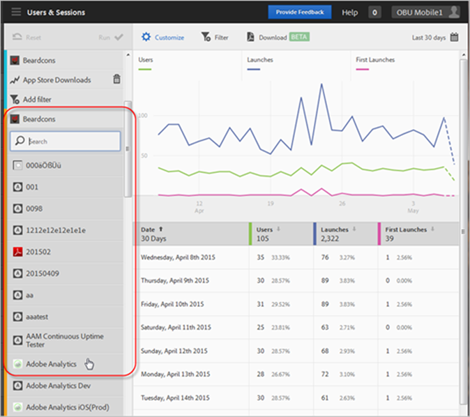

# Add Series (Metrics) to Reports{#add-series-metrics-to-reports}

This information helps you customize the built-in reports by adding additional series (metrics) or apps in different report suites to compare data.

>[!IMPORTANT]
>
>Mobile app metrics are also available in marketing reports & analytics, ad hoc analysis, data warehouse, and other [!DNL Analytics] reporting interfaces. If a breakdown or report type is not available in [!DNL Adobe Mobile], it can be generated by using a different reporting interface.

In this example, we will customize the [!DNL Users & Sessions] report, but the instructions apply to any report. 

1. Open your app and click **[!UICONTROL Usage]** > **[!UICONTROL Users & Sessions]**.

   

   This report provides a complete overtime view of our app users. However, we want to add a series to report on app crashes. 

1. Click **[!UICONTROL Customize]**.

   

1. Scroll down and click **[!UICONTROL Add Series]**.

   The name of the series is populated with the same name as the last series in your list. In the previous illustration, the latest series is **[!UICONTROL App Store Downloads]**, so a new series is added and is also titled **[!UICONTROL App Store Downloads]**. 
1. Complete one of the following tasks:

    * To add a new series (metric), click the name of the series you just created and select a new Lifecycle metric from the drop-down list.

      

    * To add a new app (in a different report suite) so that you can compare data across apps, click the app name in the newly created series and select the desired app.

          
    
      

1. (Conditional) Add filters to the new series.

   For more information, see [Add Filters to Reports](../../usage/reports-customize/t-reports-customize.md#task_B6EAC2611CD9477586B2D7C913121C7B). 
1. Click **[!UICONTROL Update]** and **[!UICONTROL Run]**.
