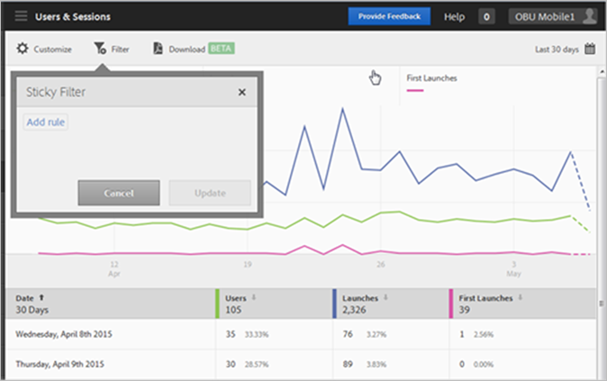
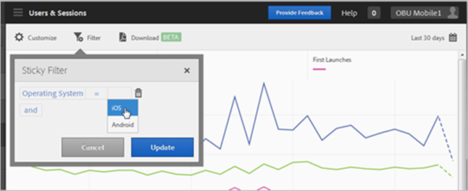
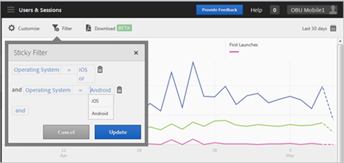

# Add Sticky Filter{#add-sticky-filter}

Create a filter that spans different reports to see how a particular segment is performing across all mobile reports. A sticky filter lets you define a filter that is applied to all non-pathing reports.

The following example adds sticky filters for iOS and Android operating systems to the [!DNL Users & Sessions] report, but the instructions apply to any report or metric. 

1. Click the **[!UICONTROL Filter]** icon at the top of any report in Adobe Mobile to access the Sticky Filter dialog box.

   

1. Click **[!UICONTROL Add Rule]**, select **[!UICONTROL Operating Systems]**, and from the drop-down list, select **[!UICONTROL iOS]**.

   We need to repeat this step to add Android as a filter.

   

1. Click **[!UICONTROL And]**, select **[!UICONTROL Operating Systems]**, and from the drop-down list, select **[!UICONTROL Android]**.

   Your filters should now look like the following example:

   

1. Click **[!UICONTROL Update]** and **[!UICONTROL Run]**.
