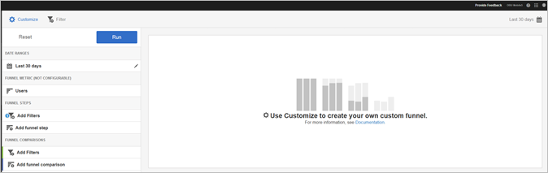

# Funnel{#funnel}

The Funnel report identifies where customers abandoned a marketing campaign or diverted from a defined conversion path while interacting with your mobile app. You can also use the Funnel report to compare the actions of different segments.

Gaining visibility into customer decisions at each step helps you understand where they are being deterred, what path they tend to follow, and when customers leave your app.

When you open the **[!UICONTROL Funnel]** report, you must create a custom funnel. For more information, see [Customize Reports](../usage/reports-customize/reports-customize.md#concept_ED099E16594044E69FFD91829F436907).

>[!TIP]
>
>To save your custom funnel, save the URL after you configure its settings and run the report. You can share the URL or save it in a document.

Here is an example of this report:

To demonstrate a simple funnel, here are the settings for a configuration that uses three funnel steps and two funnel comparisons. We assume that a demo app allows users add an item, such as photo, and then share it.

In the Customize window, there are sections to indicate that the user launched the app, added a photo from a gallery in the app, shared one or more photos from the app on social media, text message, email, and so on. The funnel comparisons allows you to compare the levels of adding and sharing photos between users of the iOS app and the Android app.

To generate the report, click **[!UICONTROL Run]**.

Here is an example of a generated report:

The first series shows that 100 percent of users launched the app. The second series shows that a higher percentage of Android users added a photo from the gallery. The third series shows that almost half of iOS users shared the photo, but none of the Android users shared the photo. This might indicate a problem with the app that needs to be investigated.

To display additional information, mouse over any bar in the chart.

You can configure the following options for this report:

<table id="table_1F79804A6A0240A98CB73A6EBE7F1068"> 
 <thead> 
  <tr> 
   <th colname="col1" class="entry"> Option </th> 
   <th colname="col2" class="entry"> Description </th> 
  </tr>
 </thead>
 <tbody> 
  <tr> 
   <td colname="col1"> 
 Time Period 
 </td> 
   <td colname="col2"> 
Click the  Calendar icon to select a custom period or to select a preset time period from the drop-down list. 
 </td> 
  </tr> 
  <tr> 
   <td colname="col1"> 
 Customize 
 </td> 
   <td colname="col2"> 
Customize your reports by changing the  Show By option, adding metrics and filters, and adding additional series (metrics), and more 
 
For more information, see <a href="../usage/reports-customize/reports-customize.md#concept_ED099E16594044E69FFD91829F436907" format="dita" scope="local"> Customize Reports</a> 
 </td> 
  </tr> 
  <tr> 
   <td colname="col1"> 
 Filter 
 </td> 
   <td colname="col2"> 
Click  Filter to create a filter that spans different reports to see how a particular segment is performing across all mobile reports. A sticky filter allows you to define a filter that is applied to all non-pathing reports. 
 
For more information, see <a href="../usage/reports-customize/t-sticky-filter.md#task_75B0AD4D58014BB0A5A09FE1B074ECE1" format="dita" scope="local"> Add Sticky Filter</a>. 
 </td> 
  </tr> 
  <tr> 
   <td colname="col1"> 
 Download 
 </td> 
   <td colname="col2"> 
Click  PDF or  CSV to download or open documents and share with users who do not have access to Mobile Services or to use it in presentations. 
 </td> 
  </tr> 
 </tbody> 
</table>

