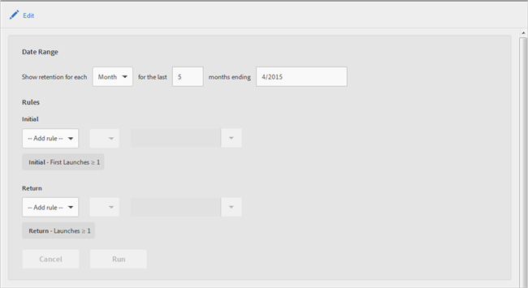

# Retention{#retention}

The **[!UICONTROL Retention]** report (formerly known as First Launch Cohorts) is a cohort report that displays how many unique users launched your app for the first time and then launched the app again at least once in the subsequent months.

By default, this report shows the retention of groups of users based on when the users first launched the app. You can also customize this report to use a metric other than First Launch and add additional actions.

A cohort is a group of people who share a common characteristic or experience in a defined period. The **[!UICONTROL Retention]** report takes the common characteristic of users who installed the app on a specific day, week, or month and charts how many of those users launched the app over the next X days, weeks, or months. The report displays how well the visitors were retained as active or engaged.

Here is an example of this report:

In the **[!UICONTROL MO]** column, the total number of people who launched the app for the first time in November 2014 is displayed. In the **[!UICONTROL M1]** column, the number of people who launched the app again in December 2014, and so on, is displayed.

To change the date range or to edit the report's rules, click **[!UICONTROL Edit]**.

The report can be populated by any variable or metric, such as Lifecycle metrics but not calculated metrics. 
