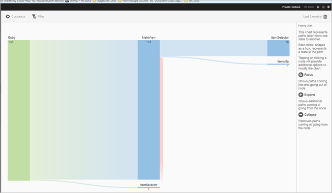
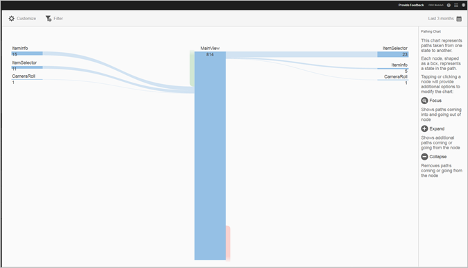
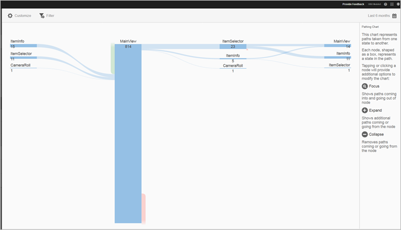

# View Paths{#view-paths}

The **[!UICONTROL View Paths]** report, which is based on path analysis, displays a pathing chart that represents the paths that were taken between states in the app.

>[!TIP]
>
>The **[!UICONTROL View Paths]** and **[!UICONTROL View Action]** reports are similar because both are pathing reports. The **[!UICONTROL View Paths]** report allows you to see how users navigate in your app from one screen to the next. The **[!UICONTROL View Actions]** report displays the sequence of actions (events, such as clicks, selections, resizing, and so on) that users perform in your app. You can use a funnel report to combine navigation and actions in one report. For more information, see [Funnel](/help/using/usage/reports-funnel.md).

Each node, shaped like a box, represents a state in the users' paths though an app. For example, in the illustration above, the top node represents the number of users that launched the app and navigated to the main view.

When you click a node to provide the additional options to modify the chart, additional options such as **[!UICONTROL Focus]** or **[!UICONTROL Expand]** appear. For example, when you click the **[!UICONTROL MainView]** state in the top node, the **[!UICONTROL Focus]** and **[!UICONTROL Expand]** icons appear.

To expand the view, click the **[!UICONTROL +]** icon to display the additional paths that come in to or go from the node. In the illustration below, state 1 is launching the app, state 2 is viewing the main page of the app, and state 3 includes the following paths that users took:

* Navigating to the camera roll
* navigating to the item selector
* navigating to the camera
* navigating to the item info page

Click  to isolate the node and to show the paths that are coming into and going out of the selected node. In the illustration below, the following paths preceded users who were viewing the main view of the app:

* item info
* item selector
* Camera roll
* Camera

You can focus or expand multiple nodes for a detailed view of the paths that users take in your app. For example:

You can configure the following options for this report:

* **[!UICONTROL Time Period]**
    Click the **[!UICONTROL Calendar]** icon to select a custom period or to select a preset time period from the drop-down list.
* **[!UICONTROL Customize]**
    Customize your reports by changing the **[!UICONTROL Show By]** options, adding metrics and filters, and adding additional series (metrics), and more. For more information, see [Customize Reports](/help/using/usage/reports-customize/reports-customize.md).
* **[!UICONTROL Filter]**
    Click **[!UICONTROL Filter]** to create a filter that spans different reports to see how a segment is performing across all mobile reports. A sticky filter allows you to define a filter that is applied to all non-pathing reports. For more information, see [Add Sticky Filter](/help/using/usage/reports-customize/t-sticky-filter.md).
* **[!UICONTROL Download]**
    Click **[!UICONTROL PDF]** or **[!UICONTROL CSV]** to download or open documents and share with users who do not have access to Mobile Services or to use the file in presentations.