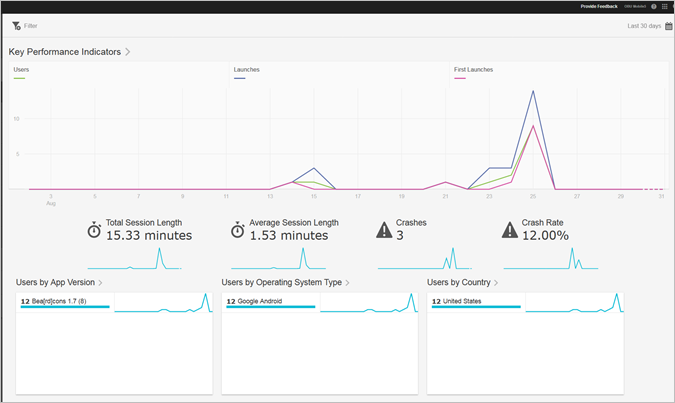

# Overview

The Overview report provides a snapshot of your key metrics.

Here is an example of this report:

You can change the date range for the report by clicking the calendar icon on the top right side. You can also create a [sticky filter](../usage/reports_customize/t_sticky_filter.md#task_75B0AD4D58014BB0A5A09FE1B074ECE1) that spans different reports to see how a segment is performing across all mobile reports.

>[!TIP]
>
>You configure the key metrics for this report while creating the app. For more information, see [Configuring your App](../c_manage_app_settings/c_mob_confg-app/c_mob_confg-app.md#concept_4C07DC7208074BAF9DD19BFF8E1ECE73).

