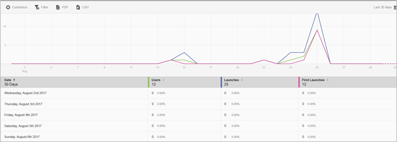

# Users and Sessions{#users-and-sessions}

The Users and Sessions report displays metrics for unique visitors during the selected time frame.

 

You can configure the following options for this report:

* **[!UICONTROL Time Period]**
    Click the **[!UICONTROL Calendar]** icon to select a custom period or to select a preset time period from the drop-down list. 
* **[!UICONTROL Customize]**
    Customize your reports by changing the **[!UICONTROL Show By]** options, adding metrics and filters, and adding additional series (metrics), and more. For more information, see [Customize Reports](../usage/reports-customize/reports-customize.md).
* **[!UICONTROL Filter]**
    Click **[!UICONTROL Filter]** to create a filter that spans different reports to see how a segment is performing across all mobile reports. A sticky filter allows you to define a filter that is applied to all non-pathing reports. For more information, see [Add Sticky Filter](../usage/reports-customize/t-sticky-filter.md).
* **[!UICONTROL Download]**
    Click **[!UICONTROL PDF]** or **[!UICONTROL CSV]** to download or open documents and share with users who do not have access to Mobile Services or to use the file in presentations.